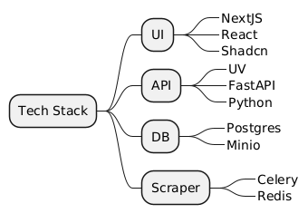
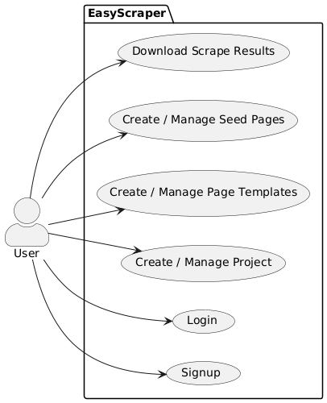
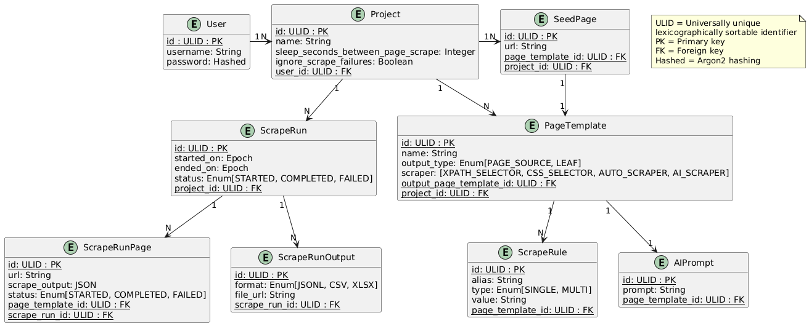
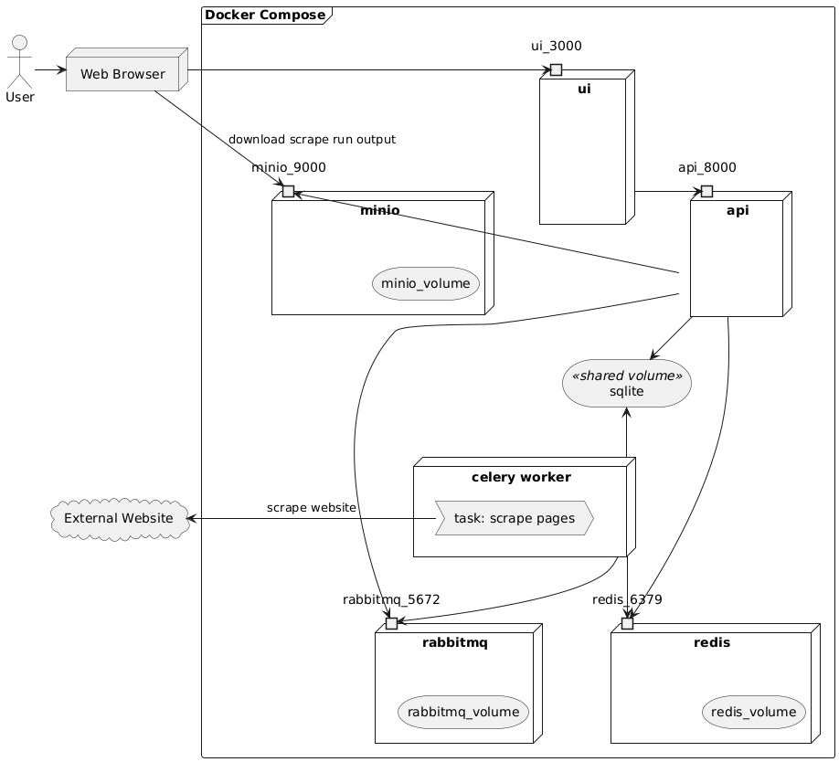
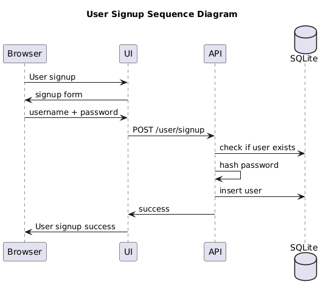
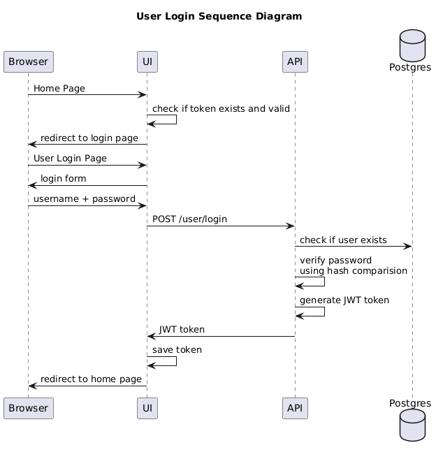

# EasyScraper

## Backlog
- [x] User can signup for a new account
- [x] User can login to account
- [x] User can create Scraping Projects
- [x] User can define Page Templates
- [x] User can define Seed Pages
- [x] User can trigger scraping for the project (each scrape run generate an output)
- [x] User can use xpath, css, auto scraper or AI scraper
- [x] User can set scrape settings- Sleep time between page scrapes
- [x] User can perform a scrape test by providing URL and Page Template
- [ ] User can import/export projects as JSON
- [ ] Kubernetes helm chart
- [ ] Github actions for build and push to dockerhub
- [ ] Use boto sdk instead of minio sdk so that there is an option to use S3 bucket
- [ ] UI implementation
- [ ] tasks.py refactor
- [ ] api documentation - add more field level details
- [ ] experiment with outlines library
- [ ] login with github option
- [ ] rate limited scraping
- [ ] use litellm for AI calls
- [ ] chrome extension to extract xpaths and css selectors?


# Architecture

## Tech Stack



## Use Case Diagram



## Database Design



## Deployment View



## Sequence Diagrams




## API documentation

https://tejas0908.github.io/EasyScraper/

Re-build api documentation
```bash
docker compose up -d --build
wget http://localhost:8000/openapi.json -O docs/openapi.json
npx @redocly/cli build-docs docs/openapi.json -o docs/index.html
```