# EasyScraper

## Intial Outline
- [x] User can signup for a new account
- [x] User can login to account
- [x] User can create Scraping Projects
- [ ] User can define Page Templates
    - Page Template
        - Output Type (Page Generator / Leaf)
        - Name (e.g. Category Page)
        - Output  (if Type=Page Generator, select which page template it returns)
        - Page Template Examples (url + list(if page generator) or dict(if leaf page)
- [ ] User can define Seed Pages
    - Seed Page
        - Url
        - Page Type
- [ ] Saving Page Templates auto builds the scraper
- [ ] User can trigger scraping for the project (each scrape run generate an output)
    - Output
        - XLSX file containing leaf rows (each sheet = one leaf type)
        - Multiple JSONL files (one per leaf type)
        - Multiple CSV files (one per leaf type)
- [ ] Scrape Runs can be resumed if they are interrupted by failures
- [ ] User can set scrape settings
    - Sleep time between page scrapes

# Tech Stack
- UI
  - Vite + React + Chakra UI
- API
  - UV + FastAPI
- DB
  - SQLlite
- TaskExecutor
  - Celery + RabbitMQ

# Architecture

## Use Cases

```mermaid
flowchart LR
    subgraph 'EasyScraper'
    uc1((Signup))
    uc2((Login))
    uc3((Create / Manage Projects))
    uc4((Create / Manage Page Templates))
    uc5((Create / Manage Seed Pages))
    uc6((Trigger Scrape Run))
    uc6((Download Scrape Results))

    end
    user[User 👤]
    user--->uc1
    user--->uc2
    user--->uc3
    user--->uc4
    user--->uc5
    user--->uc6
```

