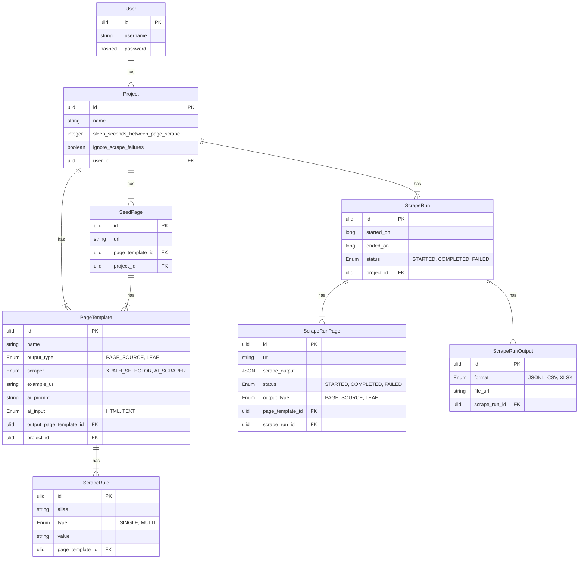
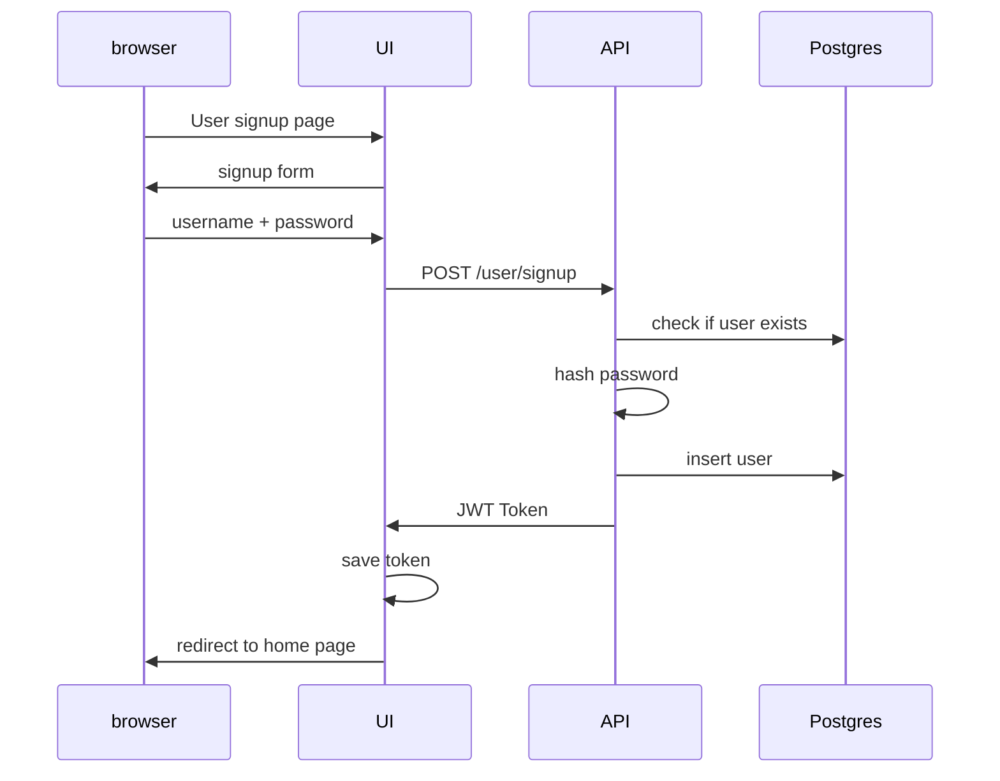

# Architecture

## Tech Stack


## Use Case Diagram


## Database Design



## Deployment View


## Sequence Diagrams




## API documentation

https://tejas0908.github.io/EasyScraper/

Re-build api documentation

```bash
docker compose up -d --build
wget http://localhost:8000/openapi.json -O docs/openapi.json
npx @redocly/cli build-docs docs/openapi.json -o docs/index.html
```
